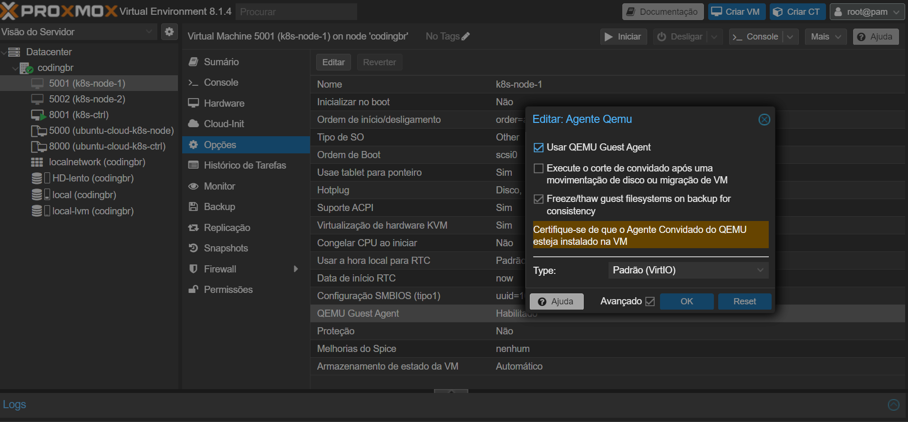
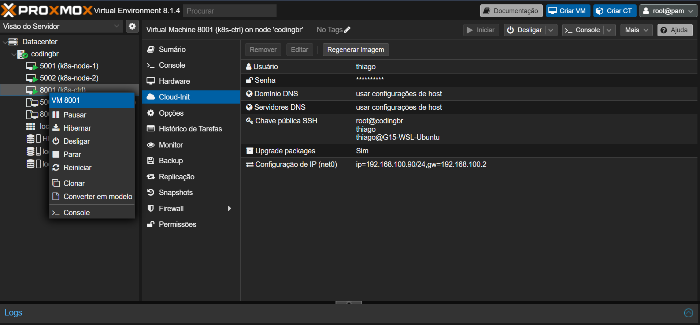

# Configuração do Homelab com Proxmox

Este repositório contém as configurações e passos necessários para configurar um homelab utilizando o Proxmox VE em um laptop com as seguintes especificações:

- Processador: 8 x Intel(R) Core(TM) i7-4700MQ CPU @ 2.40GHz (1 Socket)
- GPU: NVIDIA GTX 780M
- Armazenamento: mSATA de 512GB

## Instalação do Proxmox VE

### Pré-requisitos

- Certifique-se de que a virtualização está habilitada na BIOS/UEFI do seu laptop.
- Faça o download da imagem ISO mais recente do Proxmox VE em [Proxmox Downloads](https://www.proxmox.com/proxmox-ve).

### Instalação Passo a Passo

1. Grave a imagem ISO do Proxmox VE em uma unidade USB ou use outra mídia de instalação.
2. Inicie o laptop a partir da mídia de instalação.
3. Siga as instruções na tela para instalar o Proxmox VE no seu laptop.

## Configuração do Ambiente Proxmox

Após a instalação bem-sucedida, acesse a interface web do Proxmox VE usando um navegador. Acesse [https://seu-ip:8006](https://seu-ip:8006) e faça login com as credenciais padrão (usuário `root`, senha especificada durante a instalação).

## Configuração das Máquinas Virtuais (VMs)

### Node - Ubuntu Lunar

1. Faça o download da imagem do Ubuntu Cloud para o node:
   - [Ubuntu Lunar (Node)](https://cloud-images.ubuntu.com/lunar/current/lunar-server-cloudimg-amd64-disk-kvm.img)

2. Conecte-se via SSH ao seu servidor Proxmox.

3. Execute os seguintes comandos para criar a VM:

```bash
# Configurar as características da máquina virtual e do disco
qm set 5000 --scsihw virtio-scsi-pci --scsi0 HD-lento:vm-5000-disk-0

# Criar a VM com 2GB de RAM, 2 núcleos, nome e interface de rede
qm create 5000 --memory 2048 --cores 2 --name ubuntu-lunar --net0 virtio,bridge=vmbr0

# Importar o disco para a VM
qm importdisk 5000 lunar-server-cloudimg-amd64-disk-kvm.img local

# Configurar o disco e adicionar o disco de inicialização
qm set 5000 --scsihw virtio-scsi-pci --scsi0 local-lvm:vm-5000-disk-0
qm set 5000 --ide2 local-lvm:cloudinit

# Configurar a ordem de inicialização
qm set 5000 --boot c --bootdisk scsi0

# Configurar a serial e a interface gráfica
qm set 5000 --serial0 socket --vga serial0
```
### Controller - Ubuntu Jammy

1. Faça o download da imagem do Ubuntu Cloud para o controller:
   - [Ubuntu Jammy (Controller)](https://cloud-images.ubuntu.com/jammy/current/jammy-server-cloudimg-amd64-disk-kvm.img)

2. Conecte-se via SSH ao seu servidor Proxmox.

3. Execute os seguintes comandos para criar a VM:

```bash
# Configurar as características da máquina virtual e do disco
qm set 6000 --scsihw virtio-scsi-pci --scsi0 HD-lento:vm-6000-disk-0

# Criar a VM com 4GB de RAM, 4 núcleos, nome e interface de rede
qm create 6000 --memory 4096 --cores 4 --name ubuntu-jammy --net0 virtio,bridge=vmbr0

# Importar o disco para a VM
qm importdisk 6000 jammy-server-cloudimg-amd64-disk-kvm.iso local

# Configurar o disco e adicionar o disco de inicialização
qm set 6000 --scsihw virtio-scsi-pci --scsi0 local-lvm:vm-6000-disk-0
qm set 6000 --ide2 local-lvm:cloudinit

# Configurar a ordem de inicialização
qm set 6000 --boot c --bootdisk scsi0

# Configurar a serial e a interface gráfica
qm set 6000 --serial0 socket --vga serial0
```

## Installar qemu-guest-agent 
```bash
sudo apt install qemu-guest-agent
sudo shutdown -r now
```
### Parar a vm e habilitar o qemu
{width=1000 height=500}


## Template Cloud-Init
Ao criar novas VMs, você deve criar um templeta, e clicar em "converter em modelo" automaticamente o nome de usuário, senha e usar DHCP para o endereço IP. Aqui está um exemplo de template:


{width=1000 height=500}

Lembre-se de substituir seu-usuario, SUA-CHAVE-SSH-AQUI e senha-cifrada-aqui pelos seus próprios valores. A senha deve ser criptografada para o campo passwd. Você pode gerar uma senha criptografada usando a ferramenta mkpasswd ou uma alternativa semelhante.

Espero que isso ajude a configurar seu homelab com Proxmox!

Se precisar de mais alguma ajuda ou esclarecimento, sinta-se à vontade para perguntar!

